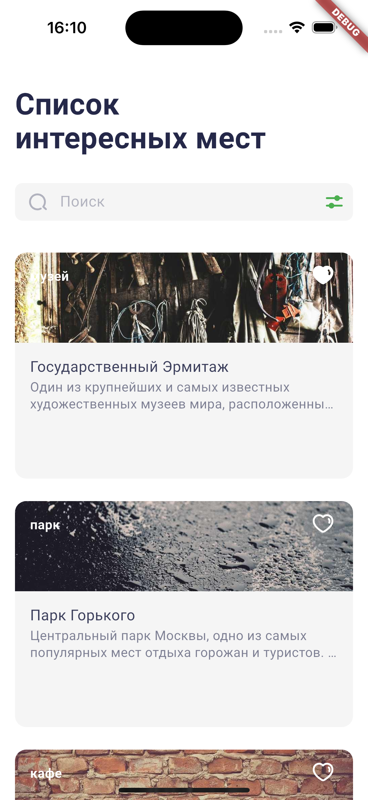
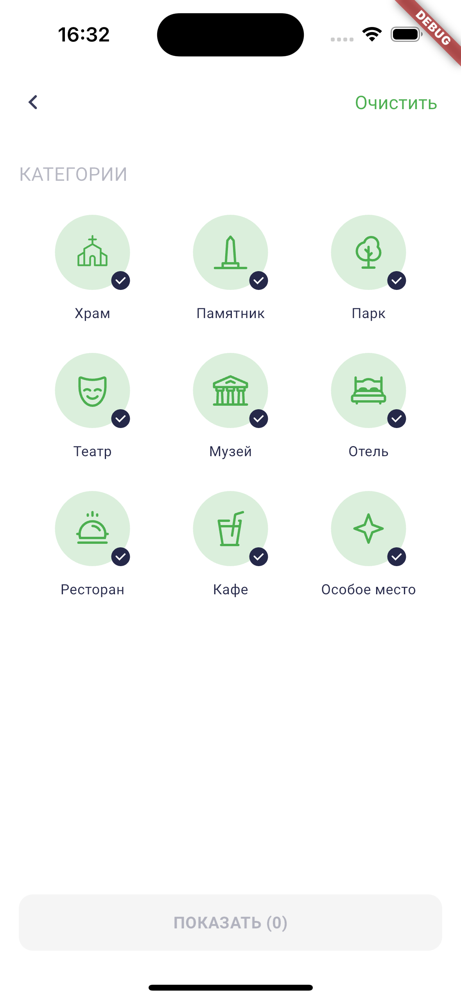
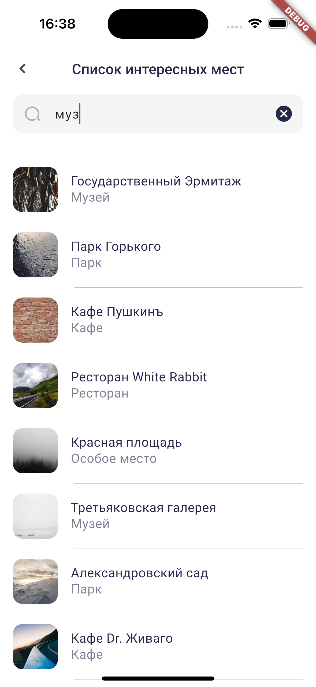
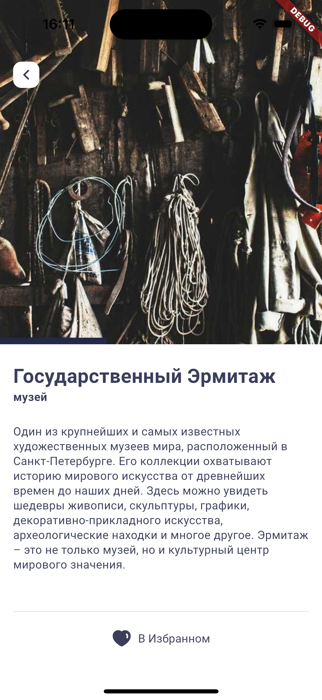
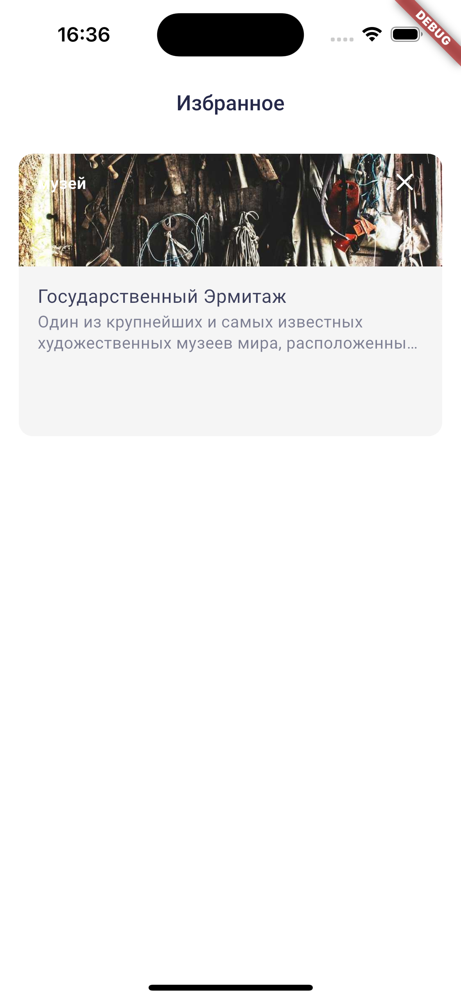
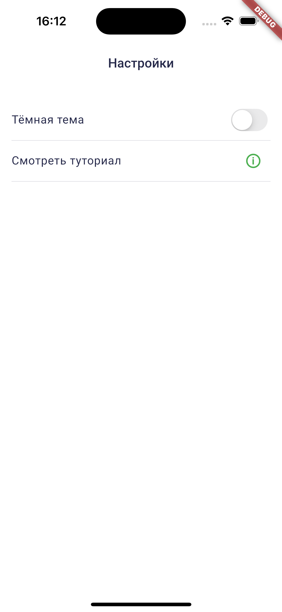
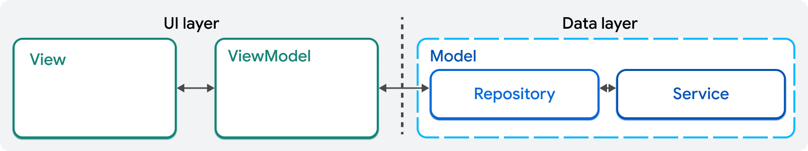

# 📱 ЛР1: Концепция приложения и вёрстка виджетов

> **Познакомимся с приложением, концепцией виджетов, в практической части необходимо будет разработать набор виджетов различной сложности.**

## 📋 Содержание
- [Настройка проекта](#-настройка-проекта)
- [Описание разрабатываемого приложения](#-описание-разрабатываемого-приложения)
- [Архитектура приложения](#️-архитектура-приложения-интересные-места)
- [Структура папок проекта](#-структура-папок-проекта)
- [Примеры кода](#-примеры-кода)
- [Система сложности заданий](#-система-сложности-заданий)
- [Задания](#-задания)

## ⚙️ Настройка проекта

Для выполнения лабораторных работ необходимо:

1. **Подготовить Flutter окружение** для разработки под платформы iOS и Android
   - [Официальная документация Flutter](https://docs.flutter.dev/get-started/install)

2. **Клонировать код проекта** из репозитория 
   > 📝 *TODO: добавить ссылку на репозиторий*

3. **Установить зависимости**, выполнив:
   ```bash
   flutter pub get
   ```

4. **Запустить приложение** на устройстве или эмуляторе

## 📱 Описание разрабатываемого приложения
В ходе выполнения лабораторных работ, будет осуществляться разработка мобильного приложения "Интересные места". В каждой лабораторной работе будут рассмотрены отдельные аспекты разработки Flutter приложения. Лабораторные работы призваны закрепить теоретические знания практическими навыками. 

Приложение "Интересные места" предоставляет пользователям возможность управлять списком интересующих их мест, искать новые места, добавлять их в список избранных.

Рассмотрим ключевые экраны приложения:

`OnboardingScreen` - экран приветствия, знакомящий пользователя с основными функциональными возможностями приложения.


`PlacesScreen` - экран списка мест, позволяет искать интересные места, переходить к экрану фильтров для поиска, экрану поиска, отображает список интересных мест.



`FilterScreen` - экран с фильтрами для поиска интересных мест. Позволяет пользователю выбрать категории мест для поиска.



`SearchScreen` - экран поиска интересных мест. На нём пользователь может поискать интересующие его места с учётом выбранных фильтров.



`PlaceDetailScreen` - экран детальной информации о месте. На нём пользователь может ознакомиться с подробной информацией о выбранной локации.



`FavoritesScreen` - экран содержащий список мест, которые пользователь добавил в избранное. Позволяет перейти на экран `PlaceDetailScreen`.



`SettingsScreen` - экран настроек приложения. Простой экран, содержащий переключатель тёмной темы и позволяющий ещё раз ознакомиться с вступительным экраном приветствия.



🎨 **Дизайн системы:** экраны приложения, виджеты и цветовая схема представлены в Figma.  
> 📝 *TODO: добавить ссылку на актуальную версию дизайна*
## 🏗️ Архитектура приложения "Интересные места"
В качестве архитектурного решения для учебного приложения будет использован [рекомендуемый разработчиками Flutter шаблон MVVM](https://docs.flutter.dev/app-architecture/guide). 
`MVVM` - это архитектурный шаблон, разделяющий фичи приложения на три части: Model, ViewModel, View.

С точки зрения архитектуры:
- Views и ViewModels образуют UI слой приложения.
- Репозитории и сервисы и образуют Data слой приложения. Взаимодействие с Data слоем осуществляется через Models.



Подробнее с подходами и концепциями шаблона MVVM можно ознакомиться в официальной документации, доступной по ссылке выше.

В нашем учебном проекте мы будем использовать другое именование для составляющих `MVVM` - `MWWM`, чтобы приблизить шаблон к терминам, используемым во Flutter, суть шаблона при этом никак не изменится.
- `Model` - остаётся без изменения.
- `View` -> `Widget` - виджеты и экраны приложения.
- `ViewModel` -> `WidgetModel` - содержат логику, преобразующую данные, полученные из Data слоя приложения в UI состояние.
## 📁 Структура папок проекта
Существует два основных подхода к организации структуры папок проекта:
1. По фичам или feature based. Каждая фича папка содержит все связанные с ней архитектурные слои внутри неё.
2. По архитектурным слоям layer based. Код проекта разбит на директории: `data`, `ui` и т.д.

Наше приложение будет использовать первый подход с небольшими модификациями.
Ниже представлена схема структуры папок проекта:
```
lib
|____api
| |____constants
| |____data
| |____service
| |____app_dio_configurator.dart
|____assets
| |____images
| |____strings
|____core
| |____data
| |____domain
|____feature
| |____app
| | |____di
| | |____app_builder.dart
| | |____app.dart
| |____common
| | |____data
| | |____domain
| | |____presentation
| |____ featureA
| |____ ...
| |____ places
| | |____data
| | |____di
| | |____domain
| | |____presentation
| | | |____widgets
| | | |____places_model.dart
| | | |____places_screen_builder.dart
| | | |____places_screen.dart
| | | |____places_wm.dart
| |____ ...
| |____ featureX
|____l10n
|____navigation
|____persistence
| |____database
| |____ ...
| |____x_storage
| |____ ...
|____uikit
| |____ themes
|____main.app
```

lib - папка с исходным кодом нашего приложения, в ней будет проходить основная работа над проектом. Содержит следующие директории:
- api - папка, содержащая все классы для работы с сетевым взаимодействием. Содержит папки:
	- constants - служит для организации констант сетевого слоя: базовые URL и т.п.
	- data - содержит DTO классы, используемые фичами нашего приложения.
	- service - содержит классы API сервисов, реализующие методы для запроса данных нашего приложения.
	- app_dio_configurator.dart - файл, отвечающий за конфигурацию HTTP клиента, используемого для отправки сетевых запросов.
- assets - содержит статические ресурсы приложения:
	- images - SVG иконки и изображения.
	- strings - строковые константы для приложения.
- core - содержит вспомогательные базовые классы, используемые для унификации и упрощения работы с кодом всех остальных фич проекта.
	- data - базовые классы data слоя для работы с данными , например, base_repository.dart.
	- domain - содержит общие для всего приложения сущности доменного слоя, например, классы обрабатываемых ошибок и т.п.
- feature - папка с основными фичами нашего приложения.
	- app - эта папка служит для организации кода корневой фичи нашего приложения, его входной точки, которая будет передана в вызов функции runApp().
		- di - содержит код, организующий Dependency Injection. Наше приложение использует Scopes и Provider для решения этой задачи.
		- app_builder.dart - корневой виджет приложения, передаётся в runApp(), оборачивает виджет App в MultiProvider, чтобы подключить DI.
		- app.dart - первый виджет приложения, подключает подписку на смену темы, возвращает экземпляр MaterialApp.
	- common - папка содержащая общие data, domain, presentation классы, которые могут использоваться повторно другими фичами приложения.
		- data - общие репозитории и другие классы data слоя.
		- domain - общие entities и другие классы domain слоя.
		- presentation - общие виджеты и другие классы presentation слоя.
	- places - на одном уровне с common находятся директории всех остальных фич приложения. В качестве примера рассмотрим папку фичи places, внутри содержатся директории для каждого архитектурного слоя. Другие фичи приложения организованы аналогичным образом.
		- data - репозиторий и другие классы data слоя, специфичные для фичи.
		- di - содержит код, отвечающий за организацию провайдера внедрения зависимостей фичи.
		- domain - специфичные для фичи entities, интерфейс для репозитория.
		- presentation - классы UI слоя приложения.
			- widgets - директория с общими виджетами фичи, которые могут использоваться на экранах этой фичи.
			- places_model.dart - model класс фичи, в котором осуществляется взаимодействие с data слоем.
			- places_screen_builder.dart - класс, подключающий провайдер зависимостей для экрана фичи.
			- places_screen.dart - основной экран фичи.
			- places_wm.dart - widget model класс, осуществляющий связь между экраном и model классом.
- l10n - папка для переводов текста приложения на другие языки.
- navigation - хранит классы, связанные маршрутизацией внутри приложения, конфигурацию навигаторов и прочее.
- persistence - директория для классов, реализующих локальное хранение данных.
	- database - папка с классами для работы с локальной БД.
	- x_storage - папки для работы с сохранением локальных данных в формате ключ-значение.
- uikit - директория с uikit-виджетами нашего приложения.
	- themes - классы для организации тем приложения, настройки цветовой схемы.
- main.app - главный файл нашего приложения.

## 💻 Примеры кода по реализации рассматриваемой в тематике работы проблемы 
Виджеты во Flutter являются основным строительным блоком пользовательского интерфейса. По своей сути они являются конфигурацией для некоторого элемента интерфейса, который должен быть отображён на экране.

Декларативный подход, используемый во Flutter, позволяет разработчику комбинировать виджеты, вкладывая их друг в друга или рядом друг с другом, для создания сложных разметок экрана.

Рассмотрим пример простейшего виджета.
```Dart
class ColoredTextBox extends StatelessWidget {
  /// Текст, который будет отображаться в виджете.
  final String text;

  /// Цвет фона для виджета.
  final Color color;

  const ColoredTextBox({
	  required this.text,
	  this.color = Colors.lightBlueAccent,
	  super.key
  });

  @override
  Widget build(BuildContext context) {
    return ColoredBox(
	    color: color,
	    child: Padding(
		    padding: const EdgeInsets.all(16),
		    child: Text('Привет, $text!'),
		),
	);
  }
}
```
- Виджет `ColoredTextBox` выводит текст в контейнере с фоном определённого цвета, добавляет отступы внутри контейнера с помощью виджета `Padding`, и с помощью виджета `Text` выводит строку на экран.
- На этом примере наглядно можно увидеть применение описанного выше декларативного подхода.

### 📚 Полезные ссылки

- [Концепция виджетов Flutter](https://docs.flutter.dev/get-started/fundamentals/widgets) - основы работы с виджетами и принципы их композиции
- [Основы вёрстки виджетов](https://docs.flutter.dev/get-started/fundamentals/layout) - подробнее об основах layout виджетов  
- [Каталог виджетов Flutter](https://docs.flutter.dev/ui/widgets) - справочник по всем доступным виджетам

## 🎯 Система сложности заданий

В данной лабораторной работе используется система градации заданий по уровню сложности. Каждое задание имеет свой уровень, который определяет:
- **Временные затраты** на выполнение
- **Сложность реализации** 
- **Количество технических аспектов** для изучения

### Уровни сложности:

| Уровень | Описание | Цветовое обозначение | Характеристика |
|---------|----------|---------------------|----------------|
| 🟢 **Простой** | Базовые концепции | `Зеленый` | Знакомство с основными виджетами Flutter, простая вёрстка |
| 🟡 **Средний** | Практическое применение | `Жёлтый` | Работа с состоянием, обработка пользовательского ввода |
| 🔴 **Сложный** | Комплексные задачи | `Красный` | Комплексная вёрстка, множество виджетов, продвинутые концепции |

> 💡 **Рекомендация**: Начинайте с заданий простого уровня и постепенно переходите к более сложным. Каждый уровень закрепляет знания предыдущего.

## 📝 Задания

### 🟢 Задание 1 - Простой уровень

**Задача:** Сверстать виджет нижней панели навигации

**Требования:**
- ✅ Сверстать виджет нижней панели навигации
- ✅ Отобразить виджет на экране
- ✅ Следовать дизайну из Figma

**Ресурсы:**
- 🎨 [Дизайн виджета в Figma](https://www.figma.com/design/V3S7KFvoSf1W6QADG8t8ly/%D0%9C%D0%B5%D1%81%D1%82%D0%B0-%D1%81-%D0%BF%D1%80%D0%BE%D1%82%D0%BE%D1%82%D0%B8%D0%BF%D0%BE%D0%BC?node-id=237-851&t=bH4d3gMVP14pqC4s-4)

**Изучаемые концепции:**
- Основы композиции виджетов
- Работа с `BottomNavigationBar`
- Основы стилизации

---

### 🟡 Задание 2 - Средний уровень

**Задача:** Сверстать виджет текстового поля поиска

**Ресурсы:**
- 🎨 [Дизайн виджета в Figma](https://www.figma.com/design/V3S7KFvoSf1W6QADG8t8ly/%D0%9C%D0%B5%D1%81%D1%82%D0%B0-%D1%81-%D0%BF%D1%80%D0%BE%D1%82%D0%BE%D1%82%D0%B8%D0%BF%D0%BE%D0%BC?node-id=229-632&t=bH4d3gMVP14pqC4s-4)


**Требования:**
- ✅ Сверстать виджет текстового поля поиска  
- ✅ Отобразить виджет на экране
- ✅ Реализовать реакцию на ввод текста пользователем
- ✅ Выводить введённый текст в консоль
- ✅ Следовать дизайну из Figma


**Изучаемые концепции:**
- Работа с `TextFormField` и `TextField`
- Обработка пользовательского ввода
- Контроллеры и слушатели событий
- Отладка через консоль

---

### 🔴 Задание 3 - Сложный уровень

**Задача:** Сверстать виджет карточки интересного места

**Ресурсы:**  
- 🎨 [Дизайн виджета в Figma](https://www.figma.com/design/V3S7KFvoSf1W6QADG8t8ly/%D0%9C%D0%B5%D1%81%D1%82%D0%B0-%D1%81-%D0%BF%D1%80%D0%BE%D1%82%D0%BE%D1%82%D0%B8%D0%BF%D0%BE%D0%BC?node-id=237-902&t=bH4d3gMVP14pqC4s-4)


**Требования:**
- ✅ Сверстать сложный виджет карточки места
- ✅ Отобразить виджет на экране  
- ✅ Реализовать все элементы из дизайна
- ✅ Обеспечить адаптивность и корректное отображение

